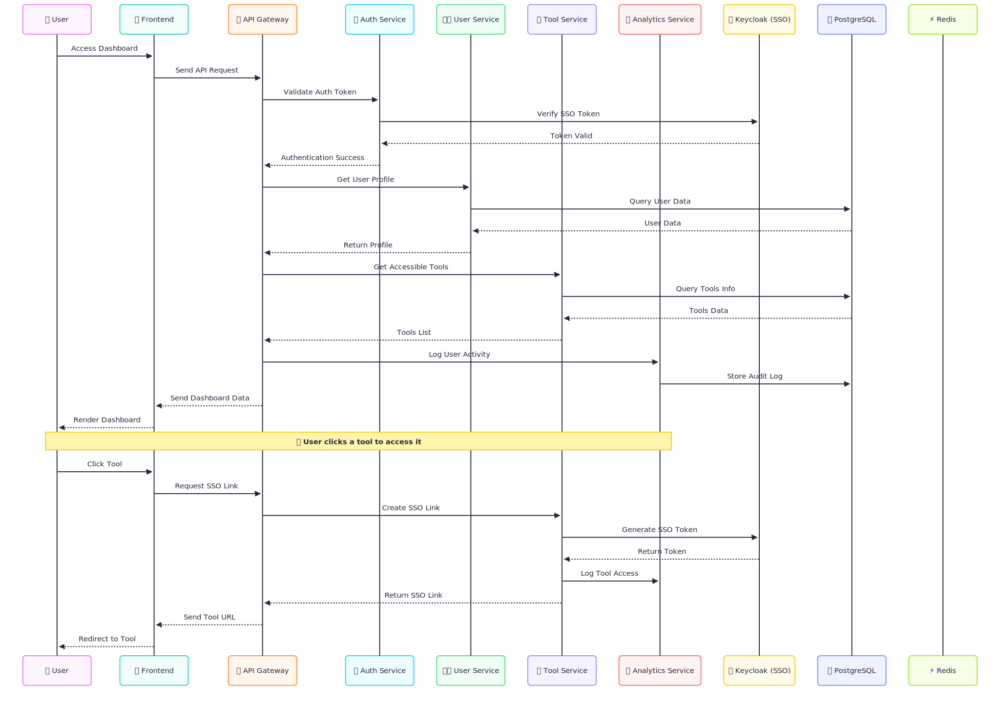

# DevOps SSO Dashboard

A comprehensive **Single Sign-On (SSO) dashboard** for DevOps tools with **Keycloak integration**, built with a **microservices architecture** using **NestJS backend** and **React frontend**. This platform provides centralized access management, real-time health monitoring, and comprehensive analytics for DevOps toolchains.

## 🎯 Project Overview

### Purpose
The DevOps SSO Dashboard serves as a unified access control and monitoring platform for DevOps tools, enabling organizations to:
- **Centralize authentication** across multiple DevOps tools
- **Monitor tool health** and performance in real-time
- **Track user activity** and access patterns
- **Manage role-based permissions** for different user groups
- **Provide analytics** on tool usage and system performance
- **Agentic AI & Many More Features comming soon** ....

### Key Objectives
- **Security**: Implement robust SSO with Keycloak and role-based access control
- **Scalability**: Microservices architecture for independent scaling
- **Monitoring**: Real-time health checks and performance analytics
- **User Experience**: Modern, responsive interface with intuitive navigation
- **Integration**: Seamless integration with existing DevOps toolchains

## 🏗️ System Architecture

### High-Level Architecture Diagram

> *High-Level Architecture Diagram*

### Detailed Service Architecture

> *High-Level Service Architecture*

### Data Flow Architecture

> *High-Level Data Flow Architecture*

## 🚀 Features

### 🔐 Authentication & Authorization
- **Single Sign-On (SSO)**: Seamless authentication with Keycloak
- **Multi-Factor Authentication**: Enhanced security with MFA support
- **Role-Based Access Control**: Fine-grained permissions based on user roles
- **Session Management**: Secure session handling with Redis
- **Token Validation**: JWT token validation and refresh mechanisms

### 👥 User Management
- **User Profiles**: Comprehensive user profile management
- **Group Management**: Create and manage user groups
- **Role Assignment**: Assign roles and permissions to users
- **User Activation/Deactivation**: Control user access
- **Password Management**: Secure password policies and reset functionality

### 🛠️ Tools Integration
- **DevOps Tools Management**: Centralized management of DevOps tools
- **Health Monitoring**: Real-time health checks for integrated tools
- **SSO Link Generation**: Automatic SSO link generation for tools
- **Access Control**: Role-based access to different tools
- **Tool Categories**: Organized tool management by categories
- **Webhook Support**: Handle tool events and notifications

### 📊 Analytics & Monitoring
- **Usage Analytics**: Track tool usage patterns and user activity
- **Audit Logging**: Comprehensive audit trails for all actions
- **Performance Metrics**: Monitor system performance and response times
- **Health Dashboards**: Real-time health status of all services
- **Custom Reports**: Generate custom analytics reports

### 🔧 System Administration
- **System Configuration**: Centralized system settings management
- **Service Health Monitoring**: Monitor all microservices health
- **Database Management**: Database health and performance monitoring
- **Log Management**: Centralized logging and log analysis
- **Backup & Recovery**: Automated backup and recovery procedures

## 🛠️ Technology Stack

### Frontend Technologies
| Technology | Version | Purpose |
|------------|---------|---------|
| **React** | 18.x | Frontend framework |
| **TypeScript** | 5.x | Type-safe JavaScript |
| **Vite** | 4.x | Build tool and dev server |
| **Tailwind CSS** | 3.x | Utility-first CSS framework |
| **Shadcn/ui** | Latest | Component library |
| **React Router** | 6.x | Client-side routing |
| **TanStack Query** | 4.x | Data fetching and caching |
| **Axios** | 1.x | HTTP client |

### Backend Technologies
| Technology | Version | Purpose |
|------------|---------|---------|
| **NestJS** | 10.x | Backend framework |
| **TypeScript** | 5.x | Type-safe JavaScript |
| **TypeORM** | 0.3.x | Database ORM |
| **PostgreSQL** | 15.x | Primary database |
| **Redis** | 7.x | Caching and sessions |
| **JWT** | Latest | Token-based authentication |
| **Helmet** | Latest | Security middleware |
| **Class Validator** | Latest | Request validation |

### Infrastructure & DevOps
| Technology | Version | Purpose |
|------------|---------|---------|
| **Docker** | 20.x+ | Containerization |
| **Docker Compose** | 2.x | Multi-container orchestration |
| **Nginx** | Latest | Reverse proxy and load balancer |
| **Keycloak** | 22.x | Identity and access management |
| **BuildKit** | Latest | Fast Docker builds |
| **Health Checks** | Built-in | Service monitoring |

### Development Tools
| Technology | Version | Purpose |
|------------|---------|---------|
| **ESLint** | Latest | Code linting |
| **Prettier** | Latest | Code formatting |
| **Husky** | Latest | Git hooks |
| **Jest** | Latest | Testing framework |
| **Swagger** | Latest | API documentation |

## 🔒 Security Considerations

### Authentication Security
- **Multi-Factor Authentication**: Support for MFA across all services
- **Token Security**: Secure JWT token handling with proper expiration
- **Session Security**: Redis-based session management with encryption
- **Password Security**: Bcrypt hashing with configurable salt rounds
- **Account Lockout**: Protection against brute force attacks

### Data Protection
- **Input Validation**: Comprehensive request validation using class-validator
- **SQL Injection Prevention**: Parameterized queries with TypeORM
- **XSS Protection**: Content Security Policy and input sanitization
- **CSRF Protection**: Cross-site request forgery prevention
- **Data Encryption**: Sensitive data encryption at rest and in transit

### Network Security
- **HTTPS Enforcement**: All communications over HTTPS
- **CORS Configuration**: Proper Cross-Origin Resource Sharing setup
- **Rate Limiting**: Protection against API abuse
- **Request Validation**: Comprehensive request validation middleware
- **Security Headers**: Helmet.js for security headers

### Access Control
- **Role-Based Access Control**: Fine-grained permissions system
- **Resource-Level Permissions**: Tool-specific access control
- **Audit Logging**: Complete audit trail for all actions
- **Session Management**: Secure session handling and timeout
- **API Security**: Secure API endpoints with proper authentication

### Compliance & Monitoring
- **Audit Trails**: Complete logging of all user actions
- **Security Monitoring**: Real-time security event monitoring
- **Data Retention**: Configurable data retention policies
- **Backup Security**: Encrypted backups with secure storage
- **Incident Response**: Security incident response procedures

## 🤝 Contributing

### Development Setup
1. **Fork the repository** and clone your fork
2. **Install dependencies** for all services
3. **Set up environment variables** using the provided template
4. **Start the development environment** using Docker Compose
5. **Run tests** to ensure everything is working

### Code Standards
- **TypeScript**: Use TypeScript for all new code
- **ESLint**: Follow the project's ESLint configuration
- **Prettier**: Use Prettier for code formatting
- **Testing**: Write tests for new features
- **Documentation**: Update documentation for API changes

### Pull Request Process
1. **Create a feature branch** from the main branch
2. **Make your changes** following the coding standards
3. **Write tests** for new functionality
4. **Update documentation** as needed
5. **Submit a pull request** with a clear description

### Commit Guidelines
- Use conventional commit messages
- Include issue numbers when applicable
- Write clear, descriptive commit messages
- Keep commits focused and atomic

### Review Process
- All pull requests require review
- Ensure all tests pass
- Verify documentation is updated
- Check for security implications
- Ensure code follows project standards

## 📄 License

This project is licensed under the **MIT License** - see the [LICENSE](LICENSE) file for details.

## 📞 Support

- **Documentation**: [API Documentation](./API_DOCUMENTATION.md)
- **Deployment**: [Deployment Guide](./DEPLOYMENT_GUIDE.md)
- **Issues**: [GitHub Issues](https://github.com/pramodksahoo/jenkins-production/issues)
- **Discussions**: [GitHub Discussions](https://github.com/pramodksahoo/jenkins-production/discussions)

## 🙏 Acknowledgments

- **NestJS Team** for the excellent backend framework
- **React Team** for the frontend framework
- **Keycloak Community** for the identity management solution
- **Docker Team** for containerization technology
- **All Contributors** who have helped improve this project

---

**Built with ❤️ for the DevOps community**

