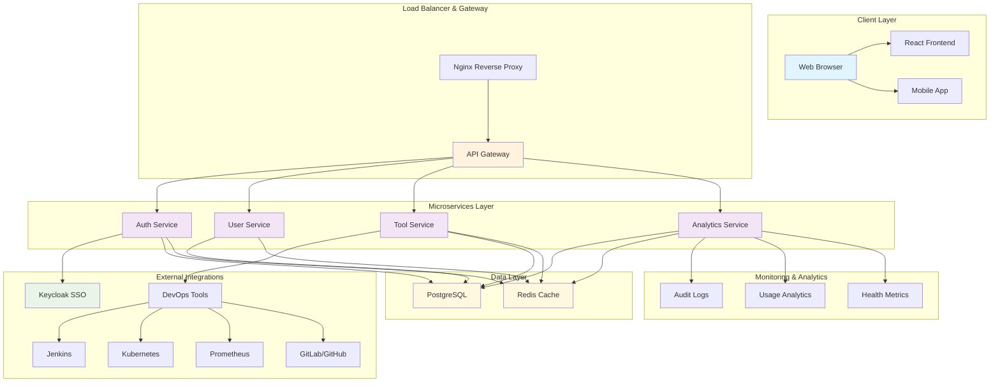
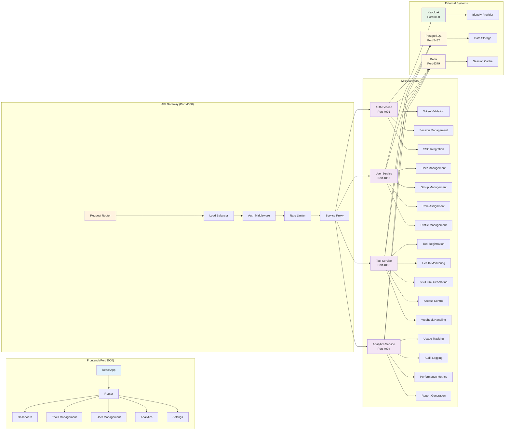
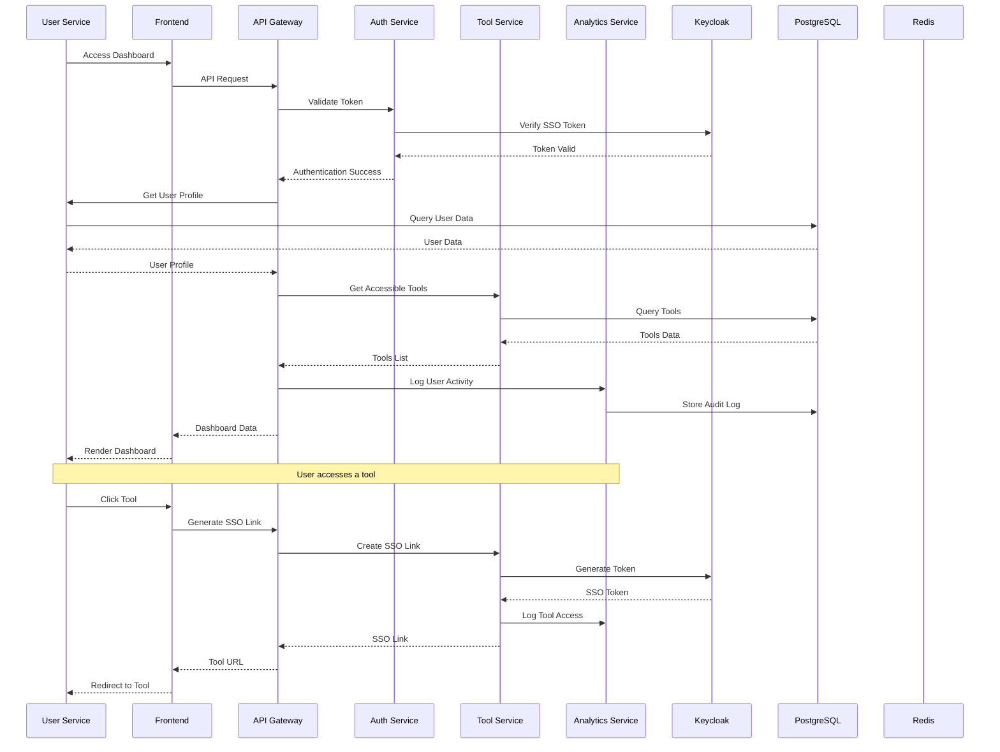

```mermaid
graph TB
    subgraph "Client Layer"
        A[Web Browser] --> B[React Frontend]
        A --> C[Mobile App]
    end
    
    subgraph "Load Balancer & Gateway"
        D[Nginx Reverse Proxy] --> E[API Gateway]
    end
    
    subgraph "Microservices Layer"
        E --> F[Auth Service]
        E --> G[User Service]
        E --> H[Tool Service]
        E --> I[Analytics Service]
    end
    
    subgraph "External Integrations"
        F --> J[Keycloak SSO]
        H --> K[DevOps Tools]
        K --> L[Jenkins]
        K --> M[Kubernetes]
        K --> N[Prometheus]
        K --> O[GitLab/GitHub]
    end
    
    subgraph "Data Layer"
        F --> P[PostgreSQL]
        G --> P
        H --> P
        I --> P
        F --> Q[Redis Cache]
        G --> Q
        H --> Q
        I --> Q
    end
    
    subgraph "Monitoring & Analytics"
        I --> R[Audit Logs]
        I --> S[Usage Analytics]
        I --> T[Health Metrics]
    end
    
    style A fill:#e1f5fe
    style E fill:#fff3e0
    style F fill:#f3e5f5
    style G fill:#f3e5f5
    style H fill:#f3e5f5
    style I fill:#f3e5f5
    style J fill:#e8f5e8
    style P fill:#fff8e1
    style Q fill:#fff8e1
```

### Detailed Service Architecture

```mermaid
graph LR
    subgraph "Frontend (Port 3000)"
        A1[React App] --> A2[Router]
        A2 --> A3[Dashboard]
        A2 --> A4[Tools Management]
        A2 --> A5[User Management]
        A2 --> A6[Analytics]
        A2 --> A7[Settings]
    end
    
    subgraph "API Gateway (Port 4000)"
        B1[Request Router] --> B2[Load Balancer]
        B2 --> B3[Auth Middleware]
        B3 --> B4[Rate Limiter]
        B4 --> B5[Service Proxy]
    end
    
    subgraph "Microservices"
        C1[Auth Service<br/>Port 4001] --> C2[Token Validation]
        C1 --> C3[Session Management]
        C1 --> C4[SSO Integration]
        
        D1[User Service<br/>Port 4002] --> D2[User Management]
        D1 --> D3[Group Management]
        D1 --> D4[Role Assignment]
        D1 --> D5[Profile Management]
        
        E1[Tool Service<br/>Port 4003] --> E2[Tool Registration]
        E1 --> E3[Health Monitoring]
        E1 --> E4[SSO Link Generation]
        E1 --> E5[Access Control]
        E1 --> E6[Webhook Handling]
        
        F1[Analytics Service<br/>Port 4004] --> F2[Usage Tracking]
        F1 --> F3[Audit Logging]
        F1 --> F4[Performance Metrics]
        F1 --> F5[Report Generation]
    end
    
    subgraph "External Systems"
        G1[Keycloak<br/>Port 8080] --> G2[Identity Provider]
        G3[PostgreSQL<br/>Port 5432] --> G4[Data Storage]
        G5[Redis<br/>Port 6379] --> G6[Session Cache]
    end
    
    B5 --> C1
    B5 --> D1
    B5 --> E1
    B5 --> F1
    
    C1 --> G1
    C1 --> G5
    D1 --> G3
    D1 --> G5
    E1 --> G3
    E1 --> G5
    F1 --> G3
    F1 --> G5
    
    style A1 fill:#e3f2fd
    style B1 fill:#fff3e0
    style C1 fill:#f3e5f5
    style D1 fill:#f3e5f5
    style E1 fill:#f3e5f5
    style F1 fill:#f3e5f5
    style G1 fill:#e8f5e8
    style G3 fill:#fff8e1
    style G5 fill:#fff8e1
```

### Data Flow Architecture

```mermaid
sequenceDiagram
    participant U as User
    participant F as Frontend
    participant G as API Gateway
    participant A as Auth Service
    participant U as User Service
    participant T as Tool Service
    participant AN as Analytics Service
    participant K as Keycloak
    participant DB as PostgreSQL
    participant R as Redis

    U->>F: Access Dashboard
    F->>G: API Request
    G->>A: Validate Token
    A->>K: Verify SSO Token
    K-->>A: Token Valid
    A-->>G: Authentication Success
    G->>U: Get User Profile
    U->>DB: Query User Data
    DB-->>U: User Data
    U-->>G: User Profile
    G->>T: Get Accessible Tools
    T->>DB: Query Tools
    DB-->>T: Tools Data
    T-->>G: Tools List
    G->>AN: Log User Activity
    AN->>DB: Store Audit Log
    G-->>F: Dashboard Data
    F-->>U: Render Dashboard

    Note over U,AN: User accesses a tool
    U->>F: Click Tool
    F->>G: Generate SSO Link
    G->>T: Create SSO Link
    T->>K: Generate Token
    K-->>T: SSO Token
    T->>AN: Log Tool Access
    T-->>G: SSO Link
    G-->>F: Tool URL
    F-->>U: Redirect to Tool
```