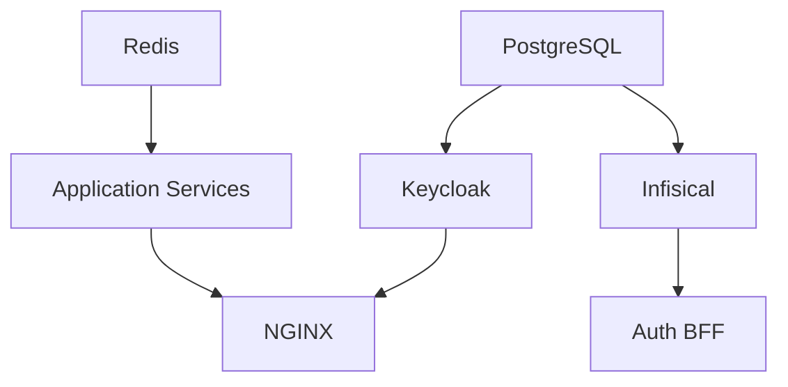

# SSO Hub Operations Runbook

## Service Overview

The SSO Hub consists of multiple microservices orchestrated via Docker Compose. This runbook covers operational procedures, troubleshooting, and maintenance tasks.

## Service Architecture

### Core Infrastructure
- **NGINX**: Reverse proxy with OIDC enforcement
- **Keycloak**: Identity Provider and authentication
- **PostgreSQL**: Primary database
- **Redis**: Session storage and message queues
- **Infisical**: Secrets management

### Application Services
- **Echo**: Sample service for testing (Phase 0)
- **Auth BFF**: Browser-to-backend session management (Phase 1)
- **Policy**: RBAC and authorization decisions (Phase 3)
- **Catalog**: Tool registry and metadata (Phase 3)
- **Tools Health**: Service and tool monitoring (Phase 4)
- **Audit**: Tamper-evident event logging (Phase 6)
- **Analytics**: Usage reporting and metrics (Phase 7)
- **Admin Config**: System configuration management (Phase 2)
- **Webhook Ingress**: External webhook processing (Phase 5)
- **Notifier**: Notification delivery (Phase 5)
- **Provisioning**: Tool provisioning automation (Phase 9)
- **Sync**: LDAP/external system synchronization (Phase 10)

## Health Checks

### Service Health Endpoints

| Service | Health Check | Expected Response |
|---------|--------------|-------------------|
| NGINX | `GET /health` | `200 OK` |
| Keycloak | `GET /health/ready` | `200 {"status":"UP"}` |
| Echo | `GET /healthz` | `200 {"status":"ok"}` |
| PostgreSQL | `pg_isready` | exit code 0 |
| Redis | `redis-cli ping` | `PONG` |
| Infisical | `GET /api/status` | `200 {"status":"ok"}` |

### Automated Health Checks

```bash
#!/bin/bash
# health-check.sh

services=("nginx:80/health" "keycloak:8080/health/ready" "echo:3001/healthz")

for service in "${services[@]}"; do
    name=$(echo $service | cut -d: -f1)
    endpoint=$(echo $service | cut -d: -f2-)
    
    if curl -f "http://localhost:$endpoint" > /dev/null 2>&1; then
        echo "✅ $name: healthy"
    else
        echo "❌ $name: unhealthy"
    fi
done
```

## Startup Procedures

### Fresh Installation

1. **Environment Setup**
   ```bash
   cp env.example .env
   # Edit .env with secure secrets
   ```

2. **Start Infrastructure**
   ```bash
   docker compose up -d postgres redis
   # Wait for databases to initialize
   ```

3. **Start Keycloak**
   ```bash
   docker compose up -d keycloak
   # Wait for Keycloak startup (1-2 minutes)
   ```

4. **Import Realm**
   ```bash
   ./infra/keycloak/setup-realm.sh
   ```

5. **Start Application Services**
   ```bash
   docker compose up -d
   ```

### Normal Startup

```bash
# Start all services
docker compose up -d

# Check overall health
docker compose ps
```

### Startup Order Dependencies



## Monitoring and Logging

### Log Locations

```bash
# All service logs
docker compose logs -f

# Specific service logs
docker compose logs -f keycloak
docker compose logs -f nginx
docker compose logs -f echo

# NGINX access/error logs
tail -f ./infra/nginx/logs/access.log
tail -f ./infra/nginx/logs/error.log
```

### Key Metrics to Monitor

1. **Authentication Success Rate**
   - Monitor Keycloak login events
   - Track OIDC callback success/failures
   - Alert on authentication errors > 5%

2. **Service Availability**
   - Health check endpoints
   - Response times
   - Error rates

3. **Database Performance**
   - Connection pool usage
   - Query performance
   - Disk usage

4. **Security Events**
   - Failed login attempts
   - Invalid token attempts
   - Rate limit violations

## Security Operations

### Certificate Management

```bash
# Generate self-signed certificates for development
openssl req -x509 -nodes -days 365 -newkey rsa:2048 \
    -keyout ./infra/nginx/ssl/nginx.key \
    -out ./infra/nginx/ssl/nginx.crt
```

### Secret Rotation

1. **Session Secrets**
   ```bash
   # Generate new session secret
   NEW_SECRET=$(openssl rand -hex 32)
   
   # Update .env
   sed -i "s/SESSION_SECRET=.*/SESSION_SECRET=$NEW_SECRET/" .env
   
   # Restart affected services
   docker compose restart nginx auth-bff
   ```

2. **Identity Header HMAC**
   ```bash
   # Generate new HMAC secret
   NEW_HMAC=$(openssl rand -hex 32)
   
   # Update .env
   sed -i "s/IDENTITY_HEADER_SECRET=.*/IDENTITY_HEADER_SECRET=$NEW_HMAC/" .env
   
   # Restart NGINX and all backend services
   docker compose restart
   ```

3. **Database Passwords**
   ```bash
   # This requires coordinated update of .env and service restart
   # 1. Update .env with new passwords
   # 2. Update database users
   # 3. Restart all services
   ```

### Audit Log Management

```bash
# View recent audit events (Phase 6)
docker compose exec postgres psql -U sso_user -d sso_hub \
    -c "SELECT * FROM audit_events ORDER BY ts DESC LIMIT 10;"

# Export audit logs for compliance
docker compose exec postgres pg_dump -U sso_user -d sso_hub \
    --table=audit_events --data-only --column-inserts > audit_export.sql
```

## Troubleshooting Guide

### Common Issues

#### 1. Keycloak Won't Start

**Symptoms:**
- Container exits with database connection errors
- Health check fails

**Diagnosis:**
```bash
docker compose logs keycloak
# Look for database connection errors
```

**Solutions:**
1. Check PostgreSQL is running and healthy
2. Verify database credentials in .env
3. Ensure keycloak database exists
4. Check network connectivity

#### 2. OIDC Authentication Failures

**Symptoms:**
- Redirected to error page after login
- "Invalid client" errors
- Token validation failures

**Diagnosis:**
```bash
# Check NGINX logs for OIDC errors
docker compose logs nginx | grep -i oidc

# Check Keycloak events
# Visit http://localhost:8080/admin -> SSO Hub realm -> Events
```

**Solutions:**
1. Verify client configuration in Keycloak matches .env
2. Check redirect URIs are correctly configured
3. Ensure discovery URL is accessible from NGINX container
4. Validate client secret matches

#### 3. Identity Headers Missing

**Symptoms:**
- Backend services receive no identity information
- X-User-* headers are empty

**Diagnosis:**
```bash
# Test echo service directly
curl -H "Host: localhost" http://localhost/app

# Check NGINX Lua script errors
docker compose logs nginx | grep -i lua
```

**Solutions:**
1. Verify HMAC secret is configured
2. Check Lua script syntax
3. Ensure user has required claims in token
4. Validate realm role mappings

#### 4. Service Discovery Issues

**Symptoms:**
- 502 Bad Gateway errors
- Services can't reach each other

**Diagnosis:**
```bash
# Check service connectivity
docker compose exec nginx curl http://echo:3001/healthz
docker compose exec echo curl http://keycloak:8080/health/ready
```

**Solutions:**
1. Verify all services are on same network
2. Check service names in docker-compose.yml
3. Ensure services are listening on 0.0.0.0, not localhost

### Performance Issues

#### High Memory Usage

```bash
# Check container memory usage
docker stats

# Identify memory-heavy containers
docker compose exec postgres top
docker compose exec keycloak top
```

#### Slow Response Times

```bash
# Check response times
curl -w "@curl-format.txt" -o /dev/null -s http://localhost/app

# Monitor database queries
docker compose exec postgres tail -f /var/log/postgresql/postgresql.log
```

### Data Recovery

#### Database Backup

```bash
# Backup all databases
docker compose exec postgres pg_dumpall -U sso_user > backup_$(date +%Y%m%d).sql

# Backup specific database
docker compose exec postgres pg_dump -U sso_user sso_hub > sso_hub_backup.sql
```

#### Database Restore

```bash
# Restore from backup
docker compose exec -T postgres psql -U sso_user -d sso_hub < sso_hub_backup.sql
```

## Maintenance Procedures

### Regular Maintenance Tasks

#### Daily
- [ ] Check service health
- [ ] Review error logs
- [ ] Monitor disk usage

#### Weekly
- [ ] Backup databases
- [ ] Review security events
- [ ] Update container images
- [ ] Clean old logs

#### Monthly
- [ ] Rotate secrets (recommended)
- [ ] Review user access
- [ ] Update documentation
- [ ] Performance optimization

### Updates and Patches

```bash
# Update container images
docker compose pull
docker compose up -d

# Update with zero downtime (rolling update)
for service in echo auth-bff policy catalog; do
    docker compose up -d --no-deps $service
    sleep 10
done
```

## Emergency Procedures

### Service Outage

1. **Identify failing service**
   ```bash
   docker compose ps
   ```

2. **Check logs for errors**
   ```bash
   docker compose logs [service-name]
   ```

3. **Restart failing service**
   ```bash
   docker compose restart [service-name]
   ```

4. **Verify recovery**
   ```bash
   docker compose ps
   # Run health checks
   ```

### Security Incident

1. **Immediate containment**
   ```bash
   # Block suspicious IPs at NGINX level
   # Add to nginx.conf: deny [IP];
   docker compose restart nginx
   ```

2. **Audit investigation**
   ```bash
   # Check audit logs for suspicious activity
   # Export relevant logs for analysis
   ```

3. **Credential rotation**
   ```bash
   # Rotate all secrets and passwords
   # Force user re-authentication
   ```

### Data Corruption

1. **Stop affected services**
   ```bash
   docker compose stop [affected-services]
   ```

2. **Restore from backup**
   ```bash
   # Restore database from latest backup
   ```

3. **Verify data integrity**
   ```bash
   # Run data validation checks
   # Verify audit log hash chains
   ```

## Contact Information

- **System Administrator**: [Contact Info]
- **Security Team**: [Contact Info]
- **On-Call Engineer**: [Contact Info]

## Documentation Links

- [Architecture Documentation](./architecture.md)
- [Security Guidelines](./security.md)
- [API Documentation](./api.md)
- [Development Guide](./development.md)
