# 5-Minute Quickstart Guide 🚀

> **Zero-friction SSO for DevOps teams. No SSO Premium. No XML nightmares. 100% Open Source.**

Get SSO Hub running in 5 minutes with our Docker Compose setup. Built by DevOps engineers, for DevOps engineers. Completely free and open-source with MIT license.

## 🎯 What You'll Get

- **Single Sign-On** for 11+ DevOps tools
- **Zero-click access** to Grafana, Jenkins, GitLab, and more
- **Production-ready** 14-microservice architecture
- **Complete audit trails** for compliance
- **Real-time monitoring** of all your tools

## ⚡ Quick Start (5 minutes)

### Prerequisites
- Docker and Docker Compose installed
- 8GB RAM minimum (recommended: 16GB)
- Ports 3000, 8080, 5432, 6379 available

### Step 1: Get SSO Hub
```bash
# Clone the repository
git clone https://github.com/pramodksahoo/devops-sso-hub.git
cd devops-sso-hub

# Copy environment template
cp .env.example .env
```

### Step 2: Configure Environment
```bash
# Edit .env file with your settings
nano .env

# Minimum required settings:
# POSTGRES_PASSWORD=your-secure-password
# REDIS_PASSWORD=your-redis-password
# SESSION_SECRET=your-session-secret-key
# IDENTITY_HEADER_SECRET=your-hmac-secret-key
```

### Step 3: Start SSO Hub
```bash
# Start all services
docker-compose up -d

# Watch the startup logs
docker-compose logs -f
```

### Step 4: Access Your SSO Hub
- **Frontend Dashboard**: http://localhost:3000
- **Keycloak Admin**: http://localhost:8080 (admin/admin)
- **Default Login**: admin@sso-hub.local / admin123

## 🎉 Success! What's Next?

### Verify Installation
```bash
# Check all services are running
docker-compose ps

# Check health status
curl http://localhost:3002/healthz  # Auth-BFF
curl http://localhost:3006/healthz  # Catalog
curl http://localhost:3004/healthz  # Tools Health
```

### Add Your First Tool
1. **Go to Admin Dashboard**: http://localhost:3000/admin
2. **Navigate to Tools Management**
3. **Click "Add Tool"** and select Jenkins, GitLab, or GitHub
4. **Follow the integration wizard**

### What You've Deployed

```mermaid
flowchart LR
    U[👤 You] --> F[🎨 Frontend<br/>:3000]
    F --> G[🚪 Gateway<br/>NGINX]
    G --> A[🔐 Auth-BFF<br/>:3002]
    A --> K[🗝️ Keycloak<br/>:8080]
    
    G --> C[⚙️ Catalog<br/>:3006]
    G --> H[💚 Health<br/>:3004]
    G --> T[📊 Analytics<br/>:3010]
    
    C --> P[(🐘 PostgreSQL<br/>:5432)]
    H --> P
    T --> P
    
    C --> R[(🔴 Redis<br/>:6379)]
    
    style F fill:#e1f5fe
    style G fill:#fff3e0
    style A fill:#ffebee
    style K fill:#ffebee
    style C fill:#e8f5e8
    style H fill:#e8f5e8
    style T fill:#e8f5e8
    style P fill:#e3f2fd
    style R fill:#ffebee
```



## 🛠️ Next Steps

### 1. Integrate Your DevOps Tools
- [Jenkins Integration](../integrations/jenkins.md) - Build automation with SSO
- [GitLab Integration](../integrations/gitlab.md) - Repository management with SAML
- [Kubernetes Integration](../integrations/kubernetes.md) - OIDC + RBAC setup
- [Grafana Integration](../integrations/grafana.md) - Seamless dashboard access

### 2. Configure User Management
- [LDAP Sync Setup](../configuration/ldap-sync.md)
- [Role-Based Access Control](../security/rbac-guide.md)
- [User Provisioning](../configuration/provisioning.md)

### 3. Set Up Monitoring
- [Health Monitoring](../configuration/health-monitoring.md)
- [Analytics Dashboard](../configuration/analytics.md)
- [Audit Logging](../security/audit-logging.md)

## 🆘 Need Help?

### Common Issues
- **Port conflicts**: Change ports in `docker-compose.yml`
- **Memory issues**: Increase Docker memory limit to 8GB+
- **Database connection errors**: Wait 2-3 minutes for PostgreSQL to fully start

### Get Support
- [Troubleshooting Guide](./TROUBLESHOOTING_GUIDE.md)
- [FAQ](./faq.md)
- [GitHub Issues](https://github.com/pramodksahoo/devops-sso-hub/issues)
- [Community Discord](https://discord.gg/your-server)

## ⏱️ Troubleshooting Quick Fixes

### Services Won't Start
```bash
# Check Docker resources
docker system df
docker system prune

# Restart with fresh containers
docker-compose down -v
docker-compose up -d
```

### Login Issues
```bash
# Reset Keycloak admin password
docker-compose exec keycloak /opt/keycloak/bin/kcadm.sh set-password --username admin --new-password admin123 --realm master

# Check auth service logs
docker-compose logs auth-bff
```

### Frontend Not Loading
```bash
# Rebuild frontend
docker-compose build --no-cache frontend
docker-compose up -d frontend

# Check frontend logs
docker-compose logs frontend
```

## 🎯 What Makes SSO Hub Different?

| Feature | SSO Hub | Keycloak | Okta | Auth0 |
|---------|---------|----------|------|-------|
| **DevOps Focus** | ✅ Built for DevOps | ❌ Enterprise-first | ❌ Generic | ❌ Generic |
| **5-Min Setup** | ✅ Docker Compose | ❌ Complex config | ❌ Cloud-only | ❌ Cloud-only |
| **No SSO Tax** | ✅ Free core features | ⚠️ Self-hosted only | ❌ Expensive | ❌ Expensive |
| **11+ Tool Integrations** | ✅ Pre-configured | ⚠️ Manual setup | ⚠️ Manual setup | ⚠️ Manual setup |
| **Seamless Access** | ✅ Zero-click launch | ❌ Multiple redirects | ❌ Multiple redirects | ❌ Multiple redirects |

---

**🎉 Congratulations!** You now have a production-ready SSO Hub running with 14 microservices, ready to integrate with your DevOps ecosystem.

**Next**: [Integrate your first DevOps tool](../integrations/) or [configure advanced security](../security/)