# DevOps Tool Integrations 🔧

> **Zero-click access to your entire DevOps toolchain**

SSO Hub provides native integrations with 11+ major DevOps tools, enabling seamless authentication and zero-click access across your entire development pipeline.

## 🚀 **Available Integrations**

### ✅ **Production Ready**
- **[Jenkins](jenkins.md)** - CI/CD automation with native OIDC plugin
- **[GitLab](gitlab.md)** - Source control with SAML/SCIM provisioning  
- **[Kubernetes](kubernetes.md)** - Container orchestration with OIDC/RBAC

### 🔄 **Coming Soon**
- **GitHub** - Repository management and GitHub Actions
- **ArgoCD** - GitOps continuous deployment
- **Grafana** - Monitoring dashboards and visualization
- **Terraform** - Infrastructure as Code management
- **HashiCorp Vault** - Secrets management
- **SonarQube** - Code quality and security analysis
- **Prometheus** - Metrics collection and alerting
- **Kibana** - Log analysis and visualization
- **Snyk** - Security vulnerability scanning

## 🎯 **Integration Features**

### 🔐 **Authentication Methods**
```yaml
Supported_Protocols:
  - OIDC: "Modern, JSON-based authentication"
  - SAML_2_0: "Enterprise federation standard"  
  - OAuth_2_0: "API access and delegation"
  - JWT: "Service-to-service communication"
```

### 🚀 **Seamless Access**
```yaml
User_Experience:
  - Zero_Click_Launch: "Direct tool access from SSO Hub dashboard"
  - Session_Persistence: "Single login for all integrated tools"
  - Auto_Provisioning: "SCIM-based user and group synchronization"
  - Role_Mapping: "SSO Hub groups to tool-specific permissions"
```

### 📡 **Real-time Integration**
```yaml
Event_Processing:
  - Webhooks: "Real-time event processing and notifications"
  - Audit_Trails: "Complete activity logging across all tools"
  - Health_Monitoring: "24/7 availability and performance tracking"
  - Analytics: "Usage patterns and performance insights"
```

## 🛠️ **Integration Patterns**

### Standard Integration Flow

```mermaid
flowchart LR
    User[👤 User] --> SSO[🔐 SSO Hub]
    SSO --> Auth[🗝️ Authentication]
    Auth --> Tool[🔧 DevOps Tool]
    Tool --> Webhook[📡 Webhook]
    Webhook --> SSO
    SSO --> Analytics[📊 Analytics]
    SSO --> Audit[📝 Audit]
```


### Configuration Pattern
```yaml
# Standard tool configuration
tool_config:
  name: "Tool Name"
  category: "CI/CD | Source Control | Monitoring"
  auth_method: "oidc | saml | oauth"
  launch_config:
    type: "seamless_sso | redirect | iframe"
    auto_login: true
    session_duration: 8 # hours
  health_check:
    endpoint: "/health"
    interval: 60 # seconds
  webhook_config:
    events: ["build_started", "deployment_complete"]
    secret: "webhook-secret"
```

## 📖 **Integration Guides**

### 🔧 **CI/CD Tools**
- **[Jenkins Integration](jenkins.md)**
  - Native OIDC plugin setup
  - Role-based access control
  - Build webhook notifications
  - Pipeline authentication

### 🗂️ **Source Control**
- **[GitLab Integration](gitlab.md)**
  - SAML 2.0 authentication
  - SCIM user provisioning
  - Group synchronization
  - Merge request webhooks

### ☸️ **Container Platforms**
- **[Kubernetes Integration](kubernetes.md)**
  - OIDC authentication for kubectl
  - RBAC configuration
  - Multi-cluster support
  - Namespace-based access

### 📊 **Additional Integration Resources**
- **[Seamless SSO Implementation](SEAMLESS_SSO_IMPLEMENTATION.md)** - Zero-click access patterns
- **[Tool Integration Specifications](tool-integration-specifications.md)** - Technical integration details

## 🔧 **Custom Integrations**

### Adding New Tools
```bash
# Use the integration generator
npm run generate-integration --tool=your-tool

# Creates:
# - Microservice template
# - Documentation template  
# - Test suite
# - Configuration schema
```

### Integration Checklist
- [ ] **Authentication** - OIDC/SAML/OAuth setup
- [ ] **Authorization** - Role and permission mapping
- [ ] **Health Monitoring** - Availability checks
- [ ] **Webhook Processing** - Event handling
- [ ] **User Provisioning** - SCIM integration (optional)
- [ ] **Documentation** - Integration guide
- [ ] **Testing** - Integration test suite

## 🎯 **Integration Roadmap**

### Q1 2026 - Core DevOps Tools
- [ ] **GitHub** - Repository management and Actions
- [ ] **ArgoCD** - GitOps deployment automation
- [ ] **HashiCorp Vault** - Secrets management
- [ ] **Terraform Cloud** - Infrastructure management

### Q2 2026 - Monitoring & Security
- [ ] **Grafana** - Enhanced monitoring and visualization
- [ ] **Prometheus** - Metrics collection and alerting
- [ ] **Datadog** - APM and monitoring platform
- [ ] **Snyk** - Security vulnerability scanning

### Q3 2026 - Enterprise & Incident Management
- [ ] **PagerDuty** - Incident management and on-call
- [ ] **New Relic** - Application performance monitoring
- [ ] **Splunk** - Enterprise log analytics
- [ ] **Kibana** - Enhanced log analysis and visualization

## 📊 **Integration Benefits**

### For DevOps Engineers
- **⚡ 5-Second Tool Access** - No more password juggling
- **🔄 Consistent Experience** - Same auth flow across all tools
- **📱 Mobile Friendly** - Access tools from any device
- **🔍 Unified Search** - Find resources across all tools

### For Security Teams
- **🛡️ Centralized Control** - Single point of access management
- **📝 Complete Audit Trails** - Activity across all integrated tools
- **🚨 Real-time Monitoring** - Security events and anomalies
- **📋 Compliance Ready** - SOC2, GDPR, HIPAA support

### For Platform Teams
- **📈 Usage Analytics** - Tool adoption and performance metrics
- **🔧 Automated Provisioning** - User and group synchronization
- **💰 Cost Optimization** - Eliminate redundant SSO licenses
- **⚡ Faster Onboarding** - New team member setup in minutes

## 🆘 **Integration Support**

### Self-Service Resources
1. **Integration Guides** - Step-by-step setup instructions
2. **Troubleshooting** - Common issues and solutions
3. **API Documentation** - Technical integration details
4. **Community Forum** - Integration discussions and help

### Professional Services
- **Custom Integration Development** - Proprietary tool integration
- **Migration Assistance** - From existing SSO solutions
- **Training and Workshops** - Team enablement sessions
- **Enterprise Support** - Dedicated integration engineer

## 📚 **Additional Resources**

- **[Getting Started](../getting-started/quickstart.md)** - Initial SSO Hub setup
- **[API Documentation](../api/README.md)** - Complete API reference
- **[Security Guide](../security/README.md)** - Security best practices
- **[Contributing](../community/CONTRIBUTING.md)** - Add new integrations

---

**Ready to integrate your tools?** Start with our [Jenkins integration guide](jenkins.md) or [request a new integration](https://github.com/pramodksahoo/devops-sso-hub/issues/new?template=integration-request.md)!