# SSO Hub Microservices Overview

## Introduction

SSO Hub is a comprehensive Single Sign-On (SSO) platform designed to integrate with 11 major DevOps tools. The platform is built using a microservices architecture that provides scalability, maintainability, and flexibility. This document provides an overview of all microservices in the system.

## Architecture Overview

The SSO Hub platform consists of 12 core microservices, each responsible for specific functionality:

```
┌─────────────────┐    ┌─────────────────┐    ┌─────────────────┐
│     Frontend    │    │     NGINX       │    │     Keycloak    │
│   (React App)   │◄──►│   (Gateway)     │◄──►│   (Identity)    │
└─────────────────┘    └─────────────────┘    └─────────────────┘
         │                       │                       │
         ▼                       ▼                       ▼
┌─────────────────────────────────────────────────────────────────┐
│                    Microservices Layer                          │
├─────────────────┬─────────────────┬─────────────────┬─────────┤
│   Auth-BFF      │   Catalog       │  Tools-Health   │Provision│
├─────────────────┼─────────────────┼─────────────────┼─────────┤
│   Analytics     │     Audit       │ Webhook-Ingress │ LDAP    │
├─────────────────┼─────────────────┼─────────────────┼─────────┤
│ Admin-Config    │    Policy       │   Notifier      │ User    │
└─────────────────┴─────────────────┴─────────────────┴─────────┘
         │                       │                       │
         ▼                       ▼                       ▼
┌─────────────────┐    ┌─────────────────┐    ┌─────────────────┐
│   PostgreSQL    │    │      Redis      │    │   External      │
│   (Database)    │    │     (Cache)     │    │  DevOps Tools   │
└─────────────────┘    └─────────────────┘    └─────────────────┘
```

### Authentication Flow


```mermaid
sequenceDiagram
    %% Participants
    participant U as 🧑 User
    participant FE as 🎨 Frontend (React)
    participant BFF as 🔐 Auth-BFF Service
    participant KC as 🗝️ Keycloak (OIDC Provider)
    participant DS as ⚙️ Downstream Service

    %% Styling Notes
    %% You can customize colors in Mermaid's theme or during render in your tool

    %% Flow
    U->>FE: Access protected resource
    FE->>BFF: Redirect to login
    BFF->>KC: OIDC Authorization Request
    KC->>U: Show Login Page
    U->>KC: Enter Credentials
    KC->>BFF: Return Authorization Code
    BFF->>KC: Exchange Code for Tokens
    BFF->>FE: Set Secure Session Cookie
    FE->>DS: Request with Identity Header
    DS->>DS: Validate Identity Header
    DS->>FE: Return Protected Resource
```

### Tool Integration Workflow


## Microservices Summary

### 1. Auth-BFF Service
- **Port**: 3002
- **Purpose**: Backend for Frontend authentication and session management
- **Key Features**: OIDC integration, session management, identity headers
- **Technology**: Fastify 4.27.0, @fastify/session, openid-client

### 2. Catalog Service
- **Port**: 3006
- **Purpose**: Tool catalog management with launch capabilities
- **Key Features**: Tool registry, launch URLs, webhook integration
- **Technology**: Fastify 4.27.0, PostgreSQL, Redis, Swagger

### 3. Tools Health Service
- **Port**: 3004
- **Purpose**: Health monitoring for all DevOps tools
- **Key Features**: Health checks, metrics collection, alerting
- **Technology**: Fastify 4.27.0, PostgreSQL, Axios

### 4. Provisioning Service
- **Port**: 3011
- **Purpose**: Automated resource provisioning across tools
- **Key Features**: Template-based provisioning, workflow automation
- **Technology**: Fastify 4.27.0, PostgreSQL, Handlebars, node-cron

### 5. Analytics Service
- **Port**: 3010
- **Purpose**: Usage analytics and reporting
- **Key Features**: Metrics collection, custom reports, data export
- **Technology**: Fastify 4.27.0, PostgreSQL, CSV export, node-cron

### 6. Audit Service
- **Port**: 3009
- **Purpose**: Comprehensive audit logging and compliance
- **Key Features**: Event collection, compliance reporting, audit trails
- **Technology**: Fastify 4.27.0, PostgreSQL, compliance frameworks

### 7. Webhook Ingress Service
- **Port**: 3007
- **Purpose**: Centralized webhook processing
- **Key Features**: Webhook reception, event processing, notification delivery
- **Technology**: Fastify 4.27.0, PostgreSQL, signature validation

### 8. LDAP Sync Service
- **Port**: 3012
- **Purpose**: LDAP directory synchronization
- **Key Features**: User sync, group management, conflict resolution
- **Technology**: Fastify 4.27.0, PostgreSQL, LDAP client, node-cron

### 9. Admin Config Service
- **Port**: 3005
- **Purpose**: Centralized configuration management
- **Key Features**: Service configs, tool integrations, validation
- **Technology**: Fastify 4.27.0, PostgreSQL, configuration schemas

### 10. User Service
- **Port**: 3003
- **Purpose**: User profile and preference management
- **Key Features**: User profiles, tool preferences, data export
- **Technology**: Fastify 4.27.0, PostgreSQL, user analytics

### 11. Policy Service
- **Port**: 3012
- **Purpose**: Access control and compliance policy management
- **Key Features**: Policy enforcement, compliance rules, governance
- **Technology**: Fastify 4.27.0, PostgreSQL, policy engine

### 12. Notifier Service
- **Port**: 3013
- **Purpose**: Centralized notification and alerting
- **Key Features**: Multi-channel notifications, templates, delivery tracking
- **Technology**: Fastify 4.27.0, PostgreSQL, Nodemailer, Slack integration

## Technology Stack

### Common Technologies
- **Runtime**: Node.js 20+
- **Framework**: Fastify 4.27.0
- **Database**: PostgreSQL 15+
- **Cache**: Redis 7+
- **Validation**: Zod 3.22.4
- **Logging**: Pino 8.17.2
- **Documentation**: Swagger/OpenAPI 3.0

### Security Features
- **Authentication**: OIDC with Keycloak
- **Authorization**: Role-based access control
- **Validation**: Input validation with Zod schemas
- **Headers**: Security headers with @fastify/helmet
- **Rate Limiting**: Request throttling with @fastify/rate-limit

## Data Flow

### Authentication Flow
1. User authenticates via Auth-BFF service
2. OIDC flow with Keycloak
3. Session creation and management
4. Identity headers generated for downstream services

### Tool Integration Flow
1. Admin configures tool integration via Admin-Config service
2. Tool registered in Catalog service
3. Health monitoring via Tools-Health service
4. Provisioning via Provisioning service
5. Webhook processing via Webhook-Ingress service

### Data Collection Flow
1. User activities logged via Audit service
2. Usage metrics collected via Analytics service
3. Health data gathered via Tools-Health service
4. Notifications sent via Notifier service

## Service Dependencies

### Core Dependencies
- **Auth-BFF**: All services depend on this for authentication
- **PostgreSQL**: Primary data storage for most services
- **Redis**: Caching and session storage
- **Keycloak**: Identity provider for authentication

### Service Dependencies
- **Catalog** ↔ **Tools-Health**: Tool information and health status
- **Provisioning** ↔ **Catalog**: Tool provisioning templates
- **Analytics** ↔ **All Services**: Data collection and metrics
- **Audit** ↔ **All Services**: Event logging and compliance
- **Webhook-Ingress** ↔ **Notifier**: Event notification delivery

## Deployment Architecture

### Container Strategy
- Each microservice runs in its own Docker container
- Services communicate via HTTP APIs
- Load balancing through NGINX gateway
- Health checks and readiness probes

### Scaling Strategy
- Horizontal scaling for stateless services
- Database connection pooling
- Redis clustering for session management
- Service mesh for inter-service communication

## Monitoring and Observability

### Health Monitoring
- `/healthz` endpoints for basic health status
- `/readyz` endpoints for service readiness
- Database connectivity checks
- External service dependency monitoring

### Logging Strategy
- Structured JSON logging with Pino
- Centralized log aggregation
- Log levels configurable per service
- Audit trail for compliance

### Metrics Collection
- Request/response timing
- Database performance metrics
- Service-specific business metrics
- Custom metrics for DevOps tools

## Security Architecture

### Authentication
- OIDC flow with Keycloak
- JWT tokens for service-to-service communication
- HMAC-signed identity headers
- Session management with secure cookies

### Authorization
- Role-based access control (RBAC)
- Tool-specific role mapping
- Policy-based access enforcement
- Audit logging for all access attempts

### Data Protection
- Input validation with Zod schemas
- SQL injection prevention
- XSS protection with security headers
- Data encryption for sensitive information

## Integration Capabilities

### Supported DevOps Tools
1. **GitHub**: Repository management, OIDC, webhooks
2. **GitLab**: Project management, OIDC, webhooks
3. **Jenkins**: Build management, OIDC, webhooks
4. **Argo CD**: Deployment management, OIDC, webhooks
5. **Terraform**: Infrastructure management, OIDC, webhooks
6. **SonarQube**: Code quality, OIDC, webhooks
7. **Grafana**: Monitoring dashboards, OIDC, webhooks
8. **Prometheus**: Metrics collection, OIDC, webhooks
9. **Kibana**: Log analysis, OIDC, webhooks
10. **Snyk**: Security scanning, OIDC, webhooks
11. **Jira/ServiceNow**: Issue tracking, OIDC, webhooks

### Integration Features
- **OIDC Integration**: Single sign-on for all tools
- **Webhook Processing**: Real-time event processing
- **API Integration**: RESTful API communication
- **Role Mapping**: SSO Hub roles to tool-specific roles
- **Provisioning**: Automated resource creation
- **Health Monitoring**: Tool availability and performance

## Development Workflow

### Service Development
- Each service has its own repository structure
- Common development patterns across services
- Shared configuration and validation schemas
- Consistent API design patterns

### Testing Strategy
- Unit tests for individual services
- Integration tests for service interactions
- End-to-end tests for complete workflows
- Performance and load testing

### Deployment Pipeline
- Docker containerization
- Automated testing and validation
- Blue-green deployment strategy
- Rollback capabilities

## Future Roadmap

### Phase 1 (Current)
- Basic microservices architecture
- Core authentication and authorization
- Tool integration and health monitoring
- Basic provisioning and webhook processing

### Phase 2 (Next)
- Advanced analytics and reporting
- Enhanced security features
- Performance optimization
- Advanced monitoring and alerting

### Phase 3 (Future)
- AI-powered insights and optimization
- Advanced workflow automation
- Machine learning integration
- Enterprise-grade features

### Phase 4 (Long-term)
- Cloud-native deployment
- Advanced scalability features
- Multi-tenant architecture
- Industry-specific compliance

## Conclusion

The SSO Hub microservices architecture provides a robust, scalable, and maintainable platform for DevOps tool integration. Each service has a clear responsibility and communicates through well-defined APIs. The architecture supports horizontal scaling, high availability, and comprehensive monitoring while maintaining security and compliance requirements.

The platform is designed to evolve with changing requirements and can be extended with new services as needed. The modular approach ensures that individual services can be updated, scaled, or replaced independently without affecting the overall system.
